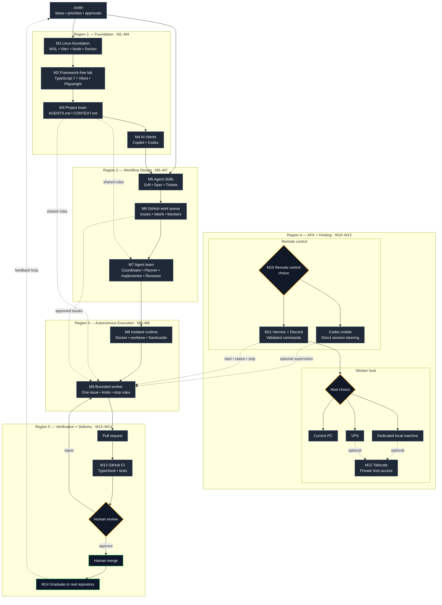
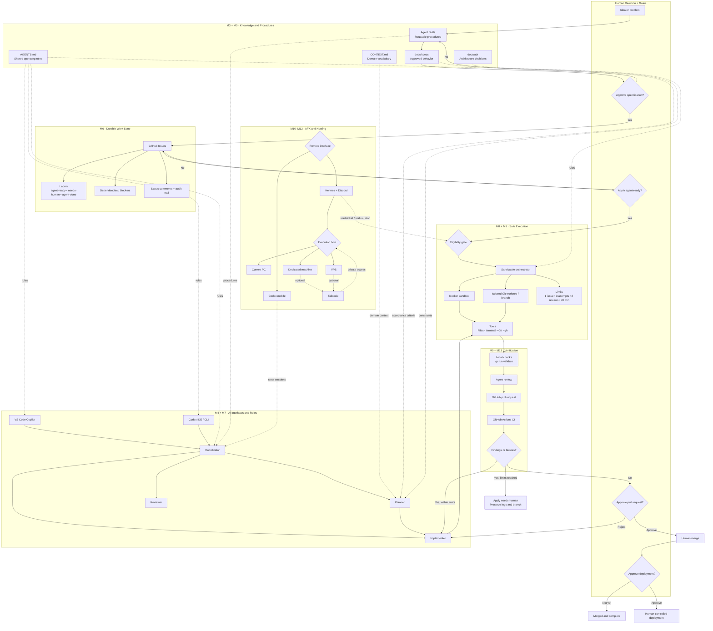
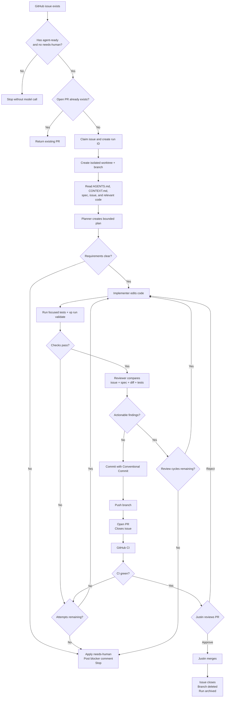
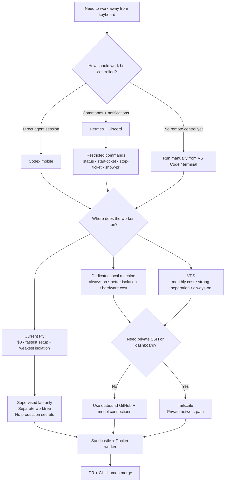
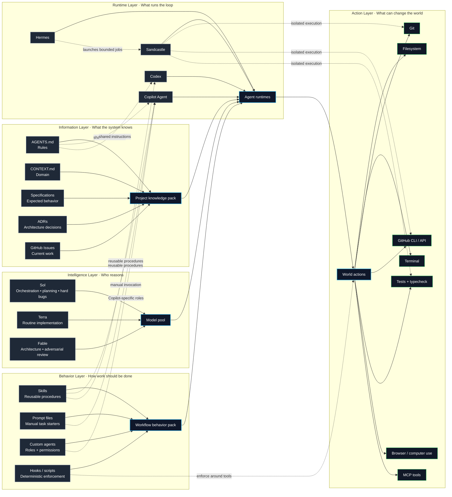
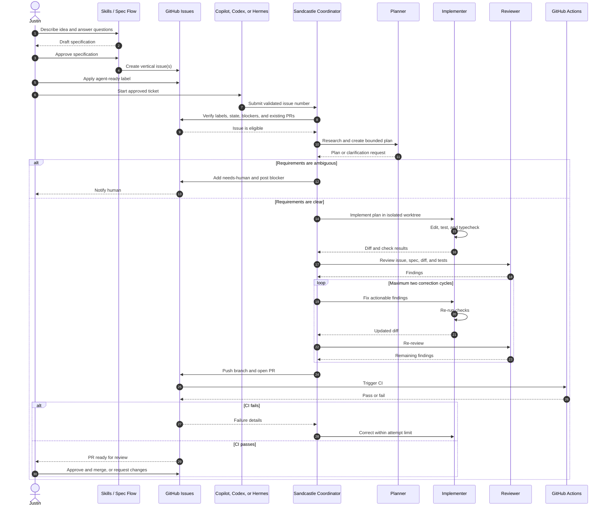

# 🧪 AI Agent Workflow Lab

> A checkpoint-based guide for building a safe, testable issue → branch → implementation → review → pull-request workflow before applying it to a real project.

## Target outcome

By the end of this guide, you will be able to:

1. Define one shared set of repository instructions that both Codex and GitHub Copilot can use.
2. Convert a small idea into a documented specification and GitHub issue.
3. Give a bounded issue to an AI coding agent.
4. Have the agent create an isolated branch, implement the change, run tests, and open a pull request.
5. Review and merge the pull request yourself.
6. Run the same workflow through Sandcastle in an isolated sandbox.
7. Start or supervise approved work remotely from a phone through Codex Remote or Hermes.

This guide deliberately starts with a tiny **framework-free TypeScript 7 repository**. It uses Vite+ for the unified toolchain, Vitest for fast tests, and Playwright for browser tests. Do not add Svelte, SvelteKit, React, Tailwind, Storybook, a database, or client code until the lab has completed at least ten clean issue-to-PR runs.

---

# 0. Recommended architecture

Use the tools as separate layers instead of forcing one product to do everything.

```text
Repository knowledge
AGENTS.md + CONTEXT.md + specs + tests
        ↓
Reusable procedures
Agent Skills
        ↓
Interactive development
VS Code Copilot or Codex
        ↓
Durable work queue
GitHub Issues
        ↓
Isolated autonomous execution
Sandcastle + Docker + Codex
        ↓
Review boundary
GitHub Pull Request + CI + human approval
        ↓
Optional remote control
Codex mobile OR Hermes + Discord
        ↓
Optional private networking
Tailscale
```

## The most important compatibility rule

Use **`AGENTS.md` at the repository root as the canonical project instruction file**.

- Codex reads `AGENTS.md` automatically.
- VS Code Copilot also supports `AGENTS.md`.
- `.github/copilot-instructions.md` is Copilot-specific. Do not assume Codex will load it.
- `.github/agents/*.agent.md` defines VS Code Copilot custom agents. Codex does not automatically use those agents.
- `.agents/skills/*/SKILL.md` is the best location for portable Agent Skills when the installer supports it.
- Install Matt Pocock's skills for both Codex and Copilot when the installer asks which agents should receive them.

Keep shared rules in one place. Add provider-specific files only when a provider genuinely needs extra behavior.

---

# 1. Cost and time summary

## Required software cost

| Item | Cost | Required now? |
|---|---:|---:|
| VS Code | $0 | Yes |
| Git and GitHub CLI | $0 | Yes |
| GitHub Free private repository | $0 | Yes |
| Vite+, Node.js, pnpm, TypeScript, Vitest, Playwright | $0 | Yes |
| Matt Pocock Skills | $0 | Milestone 5 |
| Sandcastle | $0, open source | Milestone 8 |
| Docker Desktop | $0 for personal use and qualifying small businesses | Milestone 8 |
| Tailscale Personal | $0 | Optional |
| Hermes Agent | $0, open source | Optional |
| ChatGPT Plus with Codex | $20/month, already owned | Recommended |
| GitHub Copilot | Existing plan | Recommended for VS Code custom-agent testing |

Current individual Copilot list prices:

- Copilot Pro: $10/month
- Copilot Pro+: $39/month
- Copilot Max: $100/month

## Optional hosting cost

| Host choice | Expected cost | Best use |
|---|---:|---|
| Your current PC | $0 additional | First lab and supervised runs |
| Existing spare PC | $0 additional | Always-on local worker |
| Mac mini | Starts around $799 new | Dedicated local worker; not needed for this lab |
| Small VPS | Roughly $5–$24/month | Always-on Linux worker without buying hardware |
| Managed cloud sandbox | Usage-based | Disposable jobs and stronger isolation |

Model usage can consume subscription limits or purchased credits. The software may be free while the model inference is not.

## Estimated setup time

| Milestone | Time |
|---|---:|
| 1. Verify prerequisites | 30–60 minutes |
| 2. Create the lab repository | 20–30 minutes |
| 3. Add the project brain | 20–30 minutes |
| 4. Verify Codex and Copilot separately | 30–45 minutes |
| 5. Install and test Agent Skills | 45–90 minutes |
| 6. Run the manual issue-to-PR workflow | 30–45 minutes |
| 7. Create the VS Code baby loop | 45–90 minutes |
| 8. Add Sandcastle and Docker | 60–120 minutes |
| 9. Add a bounded autonomous loop | 60–90 minutes |
| 10–13. Add AFK control, hosting, and CI | 1–4 hours, depending on option |

Expected time to reach the first safe automated pull request: **about 5–8 focused hours**.

---

# Milestone 1 — Build the Linux development foundation

## Purpose

Create one clean Linux development lane inside Windows without replacing your Windows desktop applications. All web repositories live in WSL under `~/dev`; Windows remains the desktop shell for VS Code, Photoshop, the browser, Docker Desktop, and the first Hermes test.

## Final local architecture

```text
Windows
├── VS Code desktop interface
├── Photoshop and design-source files
├── Browser and Discord
├── Docker Desktop
└── Hermes temporarily

WSL Ubuntu
└── ~/dev
    ├── All web repositories
    ├── Git and GitHub CLI
    ├── Vite+ and its managed Node/pnpm versions
    ├── Codex CLI
    ├── Claude Code
    ├── Copilot CLI
    ├── Playwright
    └── Sandcastle later
```

## Version snapshot

> Versions verified **July 25, 2026**. Use these exact versions while following the lab so every command is reproducible.

| Tool or package | Exact version | Where it belongs |
|---|---:|---|
| Ubuntu | `24.04 LTS` | WSL and future VPS |
| Node.js | `24.18.0` LTS | Managed by Vite+ |
| pnpm | `11.17.0` | Managed by Vite+ |
| `vite-plus` | `0.2.6` | Project dev dependency |
| TypeScript | `7.0.2` | Project dev dependency |
| Bundled Vitest | `4.1.10` | Supplied by Vite+ |
| `@playwright/test` | `1.61.1` | Project dev dependency |
| `@playwright/cli` | `0.1.17` | Vite+ global package |
| `@openai/codex` | `0.145.0` | Vite+ global package |
| `@anthropic-ai/claude-code` | `2.1.218` | Vite+ global package |
| `@github/copilot` | `1.0.74` | Vite+ global package |
| `skills` | `1.5.20` | Run through `vp dlx` in Milestone 5 |
| `@ai-hero/sandcastle` | `0.6.4` | Added in Milestone 8 |
| `tsx` | `4.23.1` | Added in Milestone 8 |

Vite+ `0.2.6` is still beta. It is suitable for this isolated lab, but the lab pins it exactly and treats upgrades as deliberate changes rather than automatic ones.

## What Vite+ replaces in this lab

| Use this Vite+ command | Separate tool or command no longer needed |
|---|---|
| `vp env` | NVM, fnm, or Volta |
| `vp install` | Direct `pnpm install` usage |
| `vp add` / `vp remove` | Direct `pnpm add` / `pnpm remove` usage |
| `vp dev` | Standalone Vite CLI |
| `vp check` | Separate Prettier, ESLint/Oxlint, and `tsc --noEmit` commands |
| `vp test` | Standalone Vitest CLI and dependency |
| `vp build` | Standalone Vite build command |
| `vp run` | Direct package-script execution and basic task-runner usage |
| `vp install -g` | Node global packages tied to one Node installation |

Vite+ does **not** eliminate pnpm internally. It automatically downloads and runs the pinned pnpm version. The human-facing command remains `vp`.

## Step 1. Verify or install WSL Ubuntu

From PowerShell as Administrator:

```powershell
wsl --status
wsl --list --verbose
```

Install Ubuntu only when it is missing:

```powershell
wsl --install --distribution Ubuntu-24.04
```

Restart Windows when requested, open Ubuntu, and create your Linux username and password.

## Step 2. Update WSL

Inside Ubuntu:

```bash
sudo apt update
sudo apt upgrade --yes

sudo apt install --yes \
  build-essential \
  ca-certificates \
  curl \
  git \
  jq \
  unzip
```

## Step 3. Create the single development folder

```bash
mkdir --parents ~/dev
cd ~/dev
```

All web repositories should eventually live here. Do not use `/mnt/c`, `/mnt/d`, or `/mnt/v` as the normal working location for Linux-first projects.

Keep large `.psd`, `.ai`, video, and other design-source files on the Windows Dev Drive. Copy only exported assets into the repository.

## Step 4. Install Vite+ `0.2.6`

```bash
curl -fsSL https://vite.plus | VP_VERSION=0.2.6 bash

export VP_HOME="$HOME/.vite-plus"
export PATH="$VP_HOME/bin:$PATH"

vp --version
```

Run Vite+'s shell setup and restart Ubuntu when instructed:

```bash
vp env setup
```

Then verify:

```bash
vp env doctor
```

## Step 5. Let Vite+ manage Node `24.18.0`

```bash
vp env install 24.18.0
vp env default 24.18.0
vp env current

node --version
```

Expected Node result:

```text
v24.18.0
```

Do not install Linux NVM or pnpm separately for this lab.

## Step 6. Install GitHub CLI

Use GitHub's official Ubuntu package instructions, then verify:

```bash
gh --version
gh auth login
gh auth status
```

## Step 7. Install the Linux AI CLIs through Vite+

```bash
vp install -g @openai/codex@0.145.0
vp install -g @anthropic-ai/claude-code@2.1.218
vp install -g @github/copilot@1.0.74
vp install -g @playwright/cli@0.1.17
```

Verify that every command resolves inside Linux:

```bash
command -v node
command -v vp
command -v codex
command -v claude
command -v copilot
command -v playwright-cli
```

None of these paths should begin with `/mnt/c`, `/mnt/d`, or `/mnt/v`.

Authenticate once inside WSL:

```bash
codex
claude
copilot
```

Install the Playwright CLI skills for coding agents:

```bash
playwright-cli install --skills
```

Keep your Windows copies of the same CLIs for now. A VS Code window connected to WSL uses the Linux paths; a normal Windows terminal uses the Windows paths.

## Step 8. Configure Git for Linux repositories

```bash
git config --global init.defaultBranch main
git config --global core.autocrlf input
git config --global pull.ff only

git config --global user.name "Justin O'Neill"
git config --global user.email "YOUR_GITHUB_EMAIL"
```

## Step 9. Configure Docker Desktop correctly

Install Docker Desktop on Windows once. Enable:

```text
Settings
→ General
→ Use the WSL 2 based engine

Settings
→ Resources
→ WSL Integration
→ Ubuntu enabled
```

Do **not** install Docker Engine separately inside WSL.

Verify from Ubuntu:

```bash
docker version
docker run --rm hello-world
```

The future VPS will use native Docker Engine. The local WSL environment uses Docker Desktop's WSL integration.

## Step 10. Keep Hermes on Windows temporarily

The existing Windows Hermes installation can start Linux commands through `wsl.exe`, for example:

```powershell
wsl.exe -d Ubuntu -- bash -lc "cd ~/dev/agent-workflow-lab && vp run validate"
```

This is sufficient for supervised local experiments. The final always-on Hermes worker should be installed natively on the VPS in a later milestone.

## Step 11. Create a direct VS Code shortcut

Create a Windows desktop shortcut with this target:

```text
cmd.exe /c code --remote wsl+Ubuntu /home/justin/dev
```

Also pin this folder in Windows Explorer:

```text
\\wsl.localhost\Ubuntu\home\justin\dev
```

Opening the shortcut launches the Windows VS Code interface with its terminal, extensions, Git operations, Node runtime, and CLIs running inside WSL.

## Step 12. Optional reusable bootstrap script

The final lab repository will include:

```text
scripts/bootstrap-ubuntu.sh
```

It must be idempotent and support:

```bash
./scripts/bootstrap-ubuntu.sh --wsl
./scripts/bootstrap-ubuntu.sh --vps
```

WSL mode must skip Docker Engine. VPS mode must install native Docker Engine, Docker Compose, Playwright dependencies, and basic SSH/firewall prerequisites.

## Completion check

Run inside Ubuntu:

```bash
printf 'vp: '; vp --version
printf 'node: '; node --version
printf 'git: '; git --version
printf 'gh: '; gh --version | head --lines=1
printf 'codex: '; codex --version
printf 'claude: '; claude --version
printf 'copilot: '; copilot --version
printf 'docker: '; docker --version
printf 'playwright-cli: '; playwright-cli --version
```

**Checkpoint:** all web work can live under `~/dev`, Linux tools resolve to Linux paths, and Docker commands work through Docker Desktop.

---

# Milestone 2 — Create the framework-free TypeScript lab

## Purpose

Create the smallest useful project for learning the workflow. The repository contains plain TypeScript, one tiny browser page, fast unit tests, and one Playwright end-to-end test. It has no application framework, CSS framework, component library, database, API, authentication, or deployment system.

## Lab boundaries

```text
Included
├── TypeScript 7
├── Vite+
├── Vitest through Vite+
├── Playwright
├── Git and GitHub Issues
└── Tiny counter example

Excluded
├── Svelte or SvelteKit
├── React, Vue, Astro, or another framework
├── Tailwind CSS
├── Storybook
├── Database or storage
├── Authentication
└── Production deployment
```

## Step 1. Create the repository folder

```bash
cd ~/dev
mkdir agent-workflow-lab
cd agent-workflow-lab

git init
```

## Step 2. Create the exact package manifest

```bash
cat > package.json <<'EOF'
{
  "name": "agent-workflow-lab",
  "version": "0.0.0",
  "private": true,
  "type": "module",
  "packageManager": "pnpm@11.17.0",
  "engines": {
    "node": "24.18.0"
  },
  "scripts": {
    "test:e2e": "playwright test",
    "validate": "vp check && vp test && vp run test:e2e && vp build"
  },
  "devDependencies": {
    "@playwright/test": "1.61.1",
    "typescript": "7.0.2",
    "vite-plus": "0.2.6"
  }
}
EOF

printf '24.18.0\n' > .node-version
```

Use exact versions without `^` or `~`. Commit the generated `pnpm-lock.yaml` later.

## Step 3. Create the TypeScript configuration

```bash
cat > tsconfig.json <<'EOF'
{
  "compilerOptions": {
    "target": "ES2024",
    "lib": ["ES2024", "DOM", "DOM.Iterable"],
    "module": "ESNext",
    "moduleResolution": "Bundler",
    "strict": true,
    "noUncheckedIndexedAccess": true,
    "exactOptionalPropertyTypes": true,
    "noEmit": true,
    "verbatimModuleSyntax": true,
    "skipLibCheck": true
  },
  "include": ["src", "tests", "vite.config.ts", "playwright.config.ts"]
}
EOF
```

## Step 4. Configure Vite+

```bash
cat > vite.config.ts <<'EOF'
import { defineConfig } from "vite-plus";

export default defineConfig({
  lint: {
    options: {
      typeAware: true,
      typeCheck: true,
    },
  },
  test: {
    include: ["src/**/*.test.ts"],
  },
});
EOF
```

`vp check` is now the single static-analysis command for formatting, linting, and TypeScript type checking.

## Step 5. Create the tiny implementation

```bash
mkdir --parents src tests

cat > src/counter.ts <<'EOF'
export function increment(value: number): number {
  if (!Number.isFinite(value) || !Number.isInteger(value)) {
    throw new TypeError("Counter value must be a finite integer.");
  }

  return value + 1;
}

export function decrement(value: number): number {
  if (!Number.isFinite(value) || !Number.isInteger(value)) {
    throw new TypeError("Counter value must be a finite integer.");
  }

  return value - 1;
}
EOF

cat > src/main.ts <<'EOF'
import { decrement, increment } from "./counter";

let count = 0;

const app = document.querySelector<HTMLDivElement>("#app");

if (!app) {
  throw new Error("Missing #app element.");
}

app.innerHTML = `
  <main>
    <h1>AI Agent Workflow Lab</h1>
    <p data-testid="count">0</p>
    <button data-testid="decrement" type="button">Decrease</button>
    <button data-testid="increment" type="button">Increase</button>
  </main>
`;

const countElement = app.querySelector<HTMLElement>("[data-testid='count']");
const incrementButton = app.querySelector<HTMLButtonElement>("[data-testid='increment']");
const decrementButton = app.querySelector<HTMLButtonElement>("[data-testid='decrement']");

if (!countElement || !incrementButton || !decrementButton) {
  throw new Error("Counter controls were not created.");
}

function render(): void {
  countElement.textContent = String(count);
}

incrementButton.addEventListener("click", () => {
  count = increment(count);
  render();
});

decrementButton.addEventListener("click", () => {
  count = decrement(count);
  render();
});
EOF

cat > index.html <<'EOF'
<!doctype html>
<html lang="en">
  <head>
    <meta charset="UTF-8" />
    <meta name="viewport" content="width=device-width, initial-scale=1.0" />
    <title>AI Agent Workflow Lab</title>
  </head>
  <body>
    <div id="app"></div>
    <script type="module" src="/src/main.ts"></script>
  </body>
</html>
EOF
```

## Step 6. Add the unit tests

```bash
cat > src/counter.test.ts <<'EOF'
import { describe, expect, it } from "vite-plus/test";

import { decrement, increment } from "./counter";

describe("counter", () => {
  it("increments an integer", () => {
    expect(increment(2)).toBe(3);
  });

  it("decrements an integer", () => {
    expect(decrement(2)).toBe(1);
  });

  it("rejects non-integer values", () => {
    expect(() => increment(1.5)).toThrow(TypeError);
  });
});
EOF
```

Do not add standalone `vitest`. Vite+ supplies Vitest and exposes its test API through `vite-plus/test`.

## Step 7. Add Playwright

```bash
cat > playwright.config.ts <<'EOF'
import { defineConfig } from "@playwright/test";

export default defineConfig({
  testDir: "./tests",
  fullyParallel: false,
  retries: process.env.CI ? 2 : 0,
  reporter: process.env.CI ? "github" : "list",
  use: {
    baseURL: "http://127.0.0.1:4173",
    trace: "on-first-retry",
    screenshot: "only-on-failure",
    video: "retain-on-failure",
  },
  webServer: {
    command: "vp dev --host 127.0.0.1 --port 4173",
    url: "http://127.0.0.1:4173",
    reuseExistingServer: !process.env.CI,
  },
});
EOF

cat > tests/counter.spec.ts <<'EOF'
import { expect, test } from "@playwright/test";

test("increments and decrements the visible counter", async ({ page }) => {
  await page.goto("/");

  const count = page.getByTestId("count");

  await expect(count).toHaveText("0");
  await page.getByTestId("increment").click();
  await expect(count).toHaveText("1");
  await page.getByTestId("decrement").click();
  await expect(count).toHaveText("0");
});
EOF
```

## Step 8. Install everything

```bash
vp install
vp exec playwright install --with-deps chromium
```

## Step 9. Add repository hygiene

```bash
cat > .gitignore <<'EOF'
node_modules/
dist/
.vite/
playwright-report/
test-results/
.env
.env.*
!.env.example
.sandcastle/.env
EOF

cat > .gitattributes <<'EOF'
* text=auto eol=lf
EOF
```

## Step 10. Run the canonical validation gate

```bash
vp run validate
```

This one command must pass before any branch is pushed or pull request is opened:

```text
vp check
→ vp test
→ Playwright Chromium test
→ vp build
```

## Step 11. Start the local app

```bash
vp dev
```

Open the displayed localhost address in your normal Windows browser.

## Step 12. Create the GitHub repository

Create an empty GitHub repository named:

```text
agent-workflow-lab
```

Then connect and push:

```bash
git add .
git commit -m "chore: initialize framework-free TypeScript lab"

git remote add origin git@github.com:YOUR_GITHUB_USERNAME/agent-workflow-lab.git
git push --set-upstream origin main
```

## Framework adoption note

This lab intentionally tests the workflow without a framework. When adapting it to a real SvelteKit, React, Vue, Astro, or monorepo project:

1. Recheck that framework's current TypeScript 7 and Vite+ compatibility.
2. Upgrade the existing project to modern Vite and Vitest first when required.
3. Run `vp migrate` and review every generated change.
4. Keep framework-specific diagnostics and browser tests that Vite+ does not replace.
5. Preserve the same human boundary and one canonical validation command.
6. Migrate one real repository at a time rather than changing every project simultaneously.

## Completion check

**Checkpoint:** `vp run validate` passes, the counter works in the browser, and no framework packages are installed.

---

# Milestone 3 — Create the shared project brain

## Purpose

Give every compatible agent the same rules, vocabulary, commands, boundaries, and definition of done. This is the foundation that prevents Sol from improvising a large architecture for a tiny task.

## File responsibilities

```text
AGENTS.md       Shared operating rules for Codex and Copilot
CONTEXT.md      Domain meaning and project intent
docs/specs/     Approved behavior and acceptance criteria
docs/adr/       Important architecture decisions
```

Do not duplicate all rules in both `AGENTS.md` and `.github/copilot-instructions.md`.

## Step 1. Create `AGENTS.md`

```bash
cat > AGENTS.md <<'EOF'
# Agent Instructions

## Project

This repository is an isolated, framework-free TypeScript 7 lab for testing AI issue-to-PR workflows.
Keep every change intentionally small.

## Commands

- Install dependencies: `vp install`
- Run all required checks: `vp run validate`
- Run tests: `vp test`
- Run type checking: `vp check --no-fmt --no-lint`

## Coding rules

- Use TypeScript with strict types.
- Keep each function focused on one responsibility.
- Reuse existing helpers before adding new ones.
- Use `for...of` when iteration is necessary.
- Do not use `Array.prototype.forEach`.
- Do not use classic `for (let i = 0; ...)` loops.
- Do not add a dependency without human approval.
- Do not modify unrelated files.
- Preserve working logic unless the issue explicitly requires a change.

## Git rules

- Work on one issue per branch.
- Use `feature/issue-<number>-<slug>` for features.
- Use `fix/issue-<number>-<slug>` for bug fixes.
- Use Conventional Commit messages.
- Never merge into `main`.
- Never force-push.
- Open a pull request against `main`.
- A human must approve and merge every pull request.

## Definition of done

A task is complete only when:

1. The issue acceptance criteria are satisfied.
2. Focused tests cover changed behavior.
3. `vp run validate` passes.
4. The diff contains no unrelated changes.
5. The branch is pushed.
6. A pull request links the issue.
7. The final report lists changed files and commands run.

## Stop conditions

Stop and request human input when:

- Requirements conflict or are ambiguous.
- A new dependency appears necessary.
- A destructive command appears necessary.
- Tests fail for reasons outside the issue scope.
- More than three implementation attempts fail.
- The requested work would modify authentication, secrets, deployment, billing, or production data.
EOF
```

## Step 2. Create `CONTEXT.md`

```bash
cat > CONTEXT.md <<'EOF'
# Project Context

## Purpose

This repository exists only to verify an AI-assisted development workflow.
It is not a real product and must remain intentionally small.

## Domain vocabulary

- Counter: an integer value.
- Increment: add one to a counter.
- Decrement: subtract one from a counter.
- Valid counter input: a finite integer.

## Product boundaries

- One tiny vanilla DOM page only.
- No database.
- No network requests.
- No runtime dependencies.
- No application framework.
- No CSS framework.
- No deployment.

## Quality target

Prefer the smallest implementation that clearly satisfies the approved issue.
EOF
```

## Step 3. Create documentation directories

```bash
mkdir --parents docs/specs docs/adr

touch docs/specs/.gitkeep
touch docs/adr/.gitkeep
```

## Step 4. Commit the project brain

```bash
git add AGENTS.md CONTEXT.md docs
git commit -m "docs: add shared agent instructions and context"
git push
```

## Optional Copilot-specific file

Do not add this until you find behavior that is genuinely specific to Copilot. When needed, keep it tiny:

```md
# Copilot Integration Notes

Follow the repository's root `AGENTS.md` as the canonical instruction source.
When completing a task, report changed files, checks run, and the issue or pull-request URL.
```

Store it at:

```text
.github/copilot-instructions.md
```

## Completion check

Ask both Codex and Copilot this read-only question:

```text
Without editing anything, summarize the repository's required test command,
branch naming rules, forbidden loop styles, and merge restriction.
```

Both should answer from `AGENTS.md`.

**Checkpoint:** Codex and Copilot independently recognize the same project rules.

---

# Milestone 4 — Test Codex and Copilot separately

## Purpose

Confirm each harness can read instructions, edit files, run checks, and respect Git boundaries before trying orchestration. Do not compare model intelligence yet; verify mechanics.

## Model recommendation

For this lab:

- **Codex:** start with GPT-5.6 Sol using Medium or High reasoning, Fast mode off.
- **Copilot:** use its automatic model or Sol when available.
- Later, use Terra for routine implementation and Sol for planning, difficult work, or final review.
- Do not use Ultra or unlimited subagents in this lab.

## Test A — Codex read-only check

Open Codex in the repository and ask:

```text
Read AGENTS.md and CONTEXT.md. Do not edit files or run destructive commands.
Explain what this repository is for, the command that proves a change is valid,
and which actions require human approval.
```

Pass condition: it identifies `vp run validate` and human-only merging.

## Test B — Copilot read-only check

Open Copilot Chat in Ask or Plan mode and submit the same prompt.

Pass condition: the answer matches the shared rules.

## Test C — Controlled local edit with Codex

Create a temporary branch yourself:

```bash
git switch -c test/codex-readme
```

Prompt Codex:

```text
Create README.md with a short title, purpose, installation command, and test command.
Do not commit or push. Run `vp run validate` after editing.
```

Inspect:

```bash
git diff
git status
vp run validate
```

When correct:

```bash
git add README.md
git commit -m "docs: add lab readme"
git switch main
git merge --ff-only test/codex-readme
git branch --delete test/codex-readme
git push
```

## Test D — Controlled local edit with Copilot

Create another temporary branch:

```bash
git switch -c test/copilot-note
```

Prompt Copilot Agent:

```text
Create docs/WORKFLOW.md containing a five-line summary of the intended
issue-to-branch-to-PR workflow. Do not commit or push. Run `vp run validate`.
```

Review the Chat Keep/Undo controls, choose **Keep**, inspect the diff, then commit manually:

```bash
git add docs/WORKFLOW.md
git commit -m "docs: summarize lab workflow"
git switch main
git merge --ff-only test/copilot-note
git branch --delete test/copilot-note
git push
```

## Completion check

**Checkpoint:** Both Codex and Copilot can make a bounded change and pass `vp run validate` without violating the merge rule.

---

# Milestone 5 — Install Matt Pocock's Agent Skills

## Purpose

Add reusable procedures for questioning, specifications, ticket creation, implementation, test-driven development, and review. Skills define repeatable work; they do not replace `AGENTS.md`.

> 📺 **Video walkthrough:** [mattpocock/skills: A Complete AI Coding Workflow](https://www.youtube.com/watch?v=M6mYodf0dJM)
>
> 📺 **Long-form workshop:** [Full Walkthrough: Workflow for AI Coding](https://www.youtube.com/watch?v=-QFHIoCo-Ko)
>
> 📺 **Real feature session:** [Building a Real Feature With Claude Code](https://www.youtube.com/watch?v=hX7yG1KVYhI)
>
> 📺 **Third-party workflow example:** [From Idea to Production Code in Minutes](https://www.youtube.com/watch?v=YIfluAXBr2M)

## Official repository

https://github.com/mattpocock/skills

## Step 1. Install the skills

Run from the repository root:

```bash
vp dlx skills@1.5.20 add mattpocock/skills
```

When prompted:

1. Select both Codex and GitHub Copilot/VS Code when available.
2. Install `/setup-matt-pocock-skills`.
3. Also select these initial skills:
   - `/grill-with-docs`
   - `/to-spec`
   - `/to-tickets`
   - `/implement`
   - `/tdd`
   - `/code-review`
   - `/diagnosing-bugs`
   - `/wayfinder`

Do not install everything merely because it exists. Start with the workflow above.

## Step 2. Run the setup skill

Inside a compatible agent, run:

```text
/setup-matt-pocock-skills
```

Choose:

- Issue tracker: GitHub Issues
- Documentation directory: `docs`
- Triage label: `agent-ready`
- Human clarification label: `needs-human`

If a slash command does not appear, tell the agent explicitly:

```text
Use the setup-matt-pocock-skills Agent Skill installed in this repository.
```

## Step 3. Inspect what was installed

Look for skill directories such as:

```text
.agents/skills/
.github/skills/
.claude/skills/
```

Each skill should contain `SKILL.md`. Keep the location generated by the installer; do not manually copy the same skill into every supported folder.

## Step 4. Run a tiny grilling exercise

Use `/grill-with-docs` with this idea:

```text
I want to add decrementCounter(value), which subtracts one from a valid integer.
The repository must remain dependency-free at runtime.
```

Answer its questions. Require it to save the result under:

```text
docs/specs/decrement-counter.md
```

The approved specification should include:

- Input and output behavior
- Integer requirement
- Error behavior for invalid values
- Tests
- Explicit non-goals

## Step 5. Convert the spec into tickets

Run:

```text
/to-tickets docs/specs/decrement-counter.md
```

For this lab, require one vertical ticket rather than unnecessary decomposition.

## Completion check

Verify:

```bash
gh issue list
find .agents .github -name SKILL.md 2>/dev/null
```

**Checkpoint:** A documented feature specification exists and at least one GitHub issue was created from it.

---

# Milestone 6 — Run the supervised issue-to-PR workflow

## Purpose

Prove the complete Git workflow manually before automating it. The agent may implement and open a PR, but you control when it starts and whether it merges.

> 📺 **Video walkthrough:** [I’m Using `claude --worktree` for Everything Now](https://www.youtube.com/watch?v=yv8VZpov8bk)

## Step 1. Create workflow labels once

```bash
gh label create agent-ready \
  --color 0E8A16 \
  --description "Approved for autonomous implementation" \
  --force

gh label create needs-human \
  --color FBCA04 \
  --description "Blocked on a human decision" \
  --force

gh label create agent-done \
  --color 5319E7 \
  --description "Agent completed work and opened a PR" \
  --force

gh label create feature \
  --color A2EEEF \
  --description "New behavior" \
  --force

gh label create bug \
  --color D73A4A \
  --description "Incorrect behavior" \
  --force
```

## Step 2. Create three deliberately small issues

### Issue 1 — Trivial documentation

```bash
gh issue create \
  --title "docs: add the word one" \
  --label "agent-ready,feature" \
  --body $'Create `docs/one.md`.\n\nAcceptance criteria:\n- The file contains exactly `one` followed by one newline.\n- No other file changes.\n- `vp run validate` passes.\n- Open a PR that closes this issue.'
```

### Issue 2 — Feature

```bash
gh issue create \
  --title "feat: add decrementCounter" \
  --label "agent-ready,feature" \
  --body $'Implement `decrementCounter(value)` in `src/counter.ts`.\n\nAcceptance criteria:\n- Returns the input minus one.\n- Add focused Vitest coverage.\n- Do not add dependencies.\n- `vp run validate` passes.\n- Open a PR that closes this issue.'
```

### Issue 3 — Bug fix

```bash
gh issue create \
  --title "fix: reject non-integer counter values" \
  --label "bug" \
  --body $'Counter functions currently accept non-integer values.\n\nAcceptance criteria:\n- `incrementCounter` and `decrementCounter` throw `TypeError` for non-integer input.\n- The error message is `value must be an integer`.\n- Add regression tests.\n- Do not begin until issue 2 is merged.\n- `vp run validate` passes.'
```

Leave issue 3 without `agent-ready` until issue 2 has merged.

## Step 3. Give issue 1 to Codex

In Codex, use this prompt and replace `<number>`:

```text
Implement GitHub issue #<number> in this repository.

Rules:
- Read AGENTS.md and CONTEXT.md first.
- Inspect the issue with gh.
- Create the required feature branch.
- Make only the issue's requested change.
- Run `vp run validate`.
- Review git diff before committing.
- Commit using Conventional Commits.
- Push the branch.
- Open a pull request against main that closes the issue.
- Do not merge.
- Stop after returning the PR URL, changed files, and checks run.
```

## Step 4. Review the PR yourself

```bash
gh pr list
gh pr view <pr-number> --web
```

Verify:

- Correct branch name
- Correct linked issue
- No unrelated files
- Checks passed
- PR does not auto-merge

Then merge manually:

```bash
gh pr merge <pr-number> --squash --delete-branch
```

## Step 5. Repeat for issue 2

Use the same prompt. After the feature PR merges, label issue 3:

```bash
gh issue edit <issue-3-number> --add-label agent-ready
```

## Completion check

**Checkpoint:** Two agent-created PRs were reviewed and merged by you, while issue 3 remained blocked until its dependency was satisfied.

---

# Milestone 7 — Build a VS Code “baby loop” with custom agents

## Purpose

Separate planning, implementation, and review into focused contexts without yet creating a fully autonomous background service. This is the safest place to learn orchestration.

> 📺 **Video walkthrough:** [Mastering AI With VS Code’s Agent Customizations](https://www.youtube.com/watch?v=os2eqa69gko)

## Important boundary

These `.agent.md` files are **VS Code Copilot custom agents**. They do not automatically configure Codex. Shared rules still come from `AGENTS.md`.

## Official docs

- Custom agents: https://code.visualstudio.com/docs/agent-customization/custom-agents
- Subagents: https://code.visualstudio.com/docs/agents/subagents
- Agent Skills: https://code.visualstudio.com/docs/agent-customization/agent-skills

## Step 1. Create custom agents through VS Code

1. Open the Command Palette.
2. Run `Chat: New Custom Agent`.
3. Save each workspace agent under `.github/agents/`.
4. Create:
   - `planner.agent.md`
   - `implementer.agent.md`
   - `reviewer.agent.md`
   - `coordinator.agent.md`

Use the VS Code UI to select current tool IDs rather than copying stale tool names from a tutorial.

## Step 2. Configure the planner

Purpose:

```text
Investigate one approved issue, ask questions when needed, and produce a bounded plan.
Never edit source files, commit, push, or merge.
```

Allowed capabilities:

- Read files
- Search the workspace
- Read GitHub issues
- Run non-mutating inspection commands

Model:

- Sol when architecture or ambiguity matters
- Terra for ordinary tickets

## Step 3. Configure the implementer

Purpose:

```text
Implement an approved plan on the issue branch, add tests, and run `vp run validate`.
Do not merge.
```

Allowed capabilities:

- Read and edit workspace files
- Terminal commands
- Tests and type checking
- Git commit and push
- Create a PR

Model:

- Terra for the normal default
- Sol for difficult tickets

## Step 4. Configure the reviewer

Purpose:

```text
Review the issue, specification, diff, and tests adversarially.
Return concrete findings with file locations and severity.
Do not edit files or merge.
```

Allowed capabilities:

- Read files and diffs
- Run tests
- Inspect the issue and PR

Model:

- Sol for the lab
- Fable later only when you intentionally add a Claude provider and accept its cost

## Step 5. Configure the coordinator

Purpose:

```text
Coordinate one approved GitHub issue from planning through PR readiness.
Delegate planning, implementation, and review to the appropriate custom agents.
Permit no more than two correction cycles.
Never merge.
```

Allowed capabilities:

- Invoke subagents
- Read issue and PR state
- Run Git/GitHub status commands
- Ask for human input

The coordinator should enforce this flow:

```text
read issue
→ planner
→ human clarification when needed
→ implementer
→ reviewer
→ at most two correction cycles
→ open or update PR
→ stop for human review
```

## Step 6. Test the coordinator with issue 3

Prompt:

```text
Coordinate approved issue #<issue-3-number>.
Use the planner, implementer, and reviewer custom agents.
Allow no more than two implementation-review cycles.
Stop if requirements are ambiguous or `vp run validate` cannot pass.
Do not merge. Return the pull-request URL and a concise audit trail.
```

## Completion check

**Checkpoint:** VS Code shows separate planning, implementation, and review work, and the final result is a PR requiring your approval.

---

# Milestone 8 — Install Docker and Sandcastle

## Purpose

Move execution out of the active working tree and into an isolated Linux container. Sandcastle is the programmable execution engine; GitHub remains the queue and review surface.

> 📺 **Video walkthrough:** [I Open-Sourced My Own AFK Software Factory](https://www.youtube.com/watch?v=E5-QK3CDVQM)

## Exact versions

| Package | Version |
|---|---:|
| `@ai-hero/sandcastle` | `0.6.4` |
| `tsx` | `4.23.1` |
| Docker Desktop | Current stable Windows release |
| Playwright test image, when required | `mcr.microsoft.com/playwright:v1.61.1-noble` |

## Step 1. Verify Docker Desktop integration

Docker Desktop stays installed on Windows with Ubuntu integration enabled. Do not install another Docker Engine inside WSL.

Verify inside WSL:

```bash
docker version
docker run --rm hello-world
```

## Step 2. Create the setup branch

```bash
cd ~/dev/agent-workflow-lab
git switch main
git pull --ff-only
git switch -c chore/add-sandcastle
```

## Step 3. Install exact Sandcastle dependencies

```bash
vp add -D @ai-hero/sandcastle@0.6.4 tsx@4.23.1
vp dlx @ai-hero/sandcastle@0.6.4 init
```

Choose the smallest safe options available:

- Agent: Codex
- Sandbox: Docker
- Template: `simple-loop` or the smallest starter
- Issue tracker: GitHub Issues
- Branch strategy: one isolated branch per task
- Automatic merge: disabled

## Step 4. Configure authentication safely

1. Confirm the host Codex CLI is authenticated.
2. Inspect `.sandcastle/.env.example` generated by the current Sandcastle version.
3. Copy it locally:

```bash
cp .sandcastle/.env.example .sandcastle/.env
```

4. Fill only required values.
5. Confirm `.sandcastle/.env` is ignored.

Never commit secrets or invent credential mounts that the generated template does not use.

## Step 5. Set the first Sandcastle prompt

Create or replace `.sandcastle/prompt.md`:

```md
Read AGENTS.md and CONTEXT.md.

Create `docs/sandcastle.md` containing exactly:

sandcastle works

Then run `vp run validate`.
Commit the change on the sandbox branch.
Do not open or merge a pull request.
Stop after reporting the commit hash and validation results.
```

## Step 6. Apply strict initial limits

Configure the generated runner with:

- One agent
- One sandbox
- One issue
- One branch
- Maximum two implementation iterations
- No parallel workers
- No automatic merge
- No production credentials
- Completion requires `vp run validate`

Use the exact model identifier exposed by the current Codex installation instead of guessing a model name.

## Step 7. Run Sandcastle

Use the generated entry file. It will commonly resemble:

```bash
vp exec tsx .sandcastle/main.ts
```

Or, when generated as ESM:

```bash
vp exec tsx .sandcastle/main.mts
```

Inspect the result:

```bash
git status
git branch --all
git log --oneline --all --decorate --max-count=20
```

## Step 8. Browser testing inside a sandbox

A normal Node sandbox does not need a graphical browser. When the worker must run Playwright end-to-end tests, use a sandbox image that contains the matching browsers and Linux dependencies:

```text
mcr.microsoft.com/playwright:v1.61.1-noble
```

Keep `@playwright/test@1.61.1` and the Docker image version aligned.

## Step 9. Commit the configuration through a PR

```bash
git add package.json pnpm-lock.yaml .sandcastle .gitignore
git status
git commit -m "chore: add bounded Sandcastle runner"
git push --set-upstream origin chore/add-sandcastle
gh pr create --fill --base main
```

Review and merge manually.

## Completion check

**Checkpoint:** Sandcastle ran a coding agent inside Docker, created the requested change on an isolated branch, passed `vp run validate`, and did not merge automatically.

---

# Milestone 9 — Build the bounded issue-to-PR loop

## Purpose

Convert Sandcastle from a one-off prompt runner into a controlled worker that handles exactly one approved issue and stops at a pull request.

> 📺 **Video walkthrough:** [How to Write AI Agent Loops in Claude Code and Codex](https://www.youtube.com/watch?v=JoXbk2fm7jM)

## Required state machine

```text
agent-ready issue
→ claim issue
→ isolated branch
→ inspect AGENTS.md, CONTEXT.md, spec, and issue
→ implement
→ vp run validate
→ self-review
→ maximum two corrections
→ push
→ PR
→ label agent-done
→ stop for human
```

## Hard limits

Set these before any AFK use:

| Control | Initial value |
|---|---:|
| Concurrent issues | 1 |
| Implementation attempts | 3 |
| Review correction cycles | 2 |
| Subagents | 2 maximum |
| Wall-clock limit | 45 minutes |
| Automatic merge | Off |
| Production credentials | None |
| Daily purchased-credit budget | $10–$25 |

A loop without limits is not automation; it is an uncontrolled bill and code generator.

## Step 1. Create a dedicated test issue

```bash
gh issue create \
  --title "feat: add addCounter" \
  --label "agent-ready,feature" \
  --body $'Add `addCounter(value, step)`.\n\nAcceptance criteria:\n- Both arguments must be finite integers.\n- Return `value + step`.\n- Invalid input throws `TypeError` with a clear argument-specific message.\n- Add focused tests.\n- Do not add dependencies.\n- `vp run validate` passes.\n- Open a PR and stop without merging.'
```

## Step 2. Make the worker accept one issue number

The runner should require an explicit issue number from one of these sources:

- CLI argument, preferred for the lab
- Environment variable
- A Discord command later

Example interface:

```bash
vp run sandcastle:issue --issue 4
```

Never begin by polling every open issue indefinitely.

## Step 3. Require an eligibility check

Before starting, the runner must verify:

- Issue exists
- Issue is open
- Issue has `agent-ready`
- Issue does not have `needs-human`
- No open PR already closes it
- Repository working tree is clean
- No other worker currently owns it

When any check fails, stop without invoking a model.

## Step 4. Require a completion contract

The worker succeeds only when all are true:

- Branch exists remotely
- Commit exists
- `vp run validate` passed after the final edit
- PR is open against `main`
- PR body contains `Closes #<issue-number>`
- No merge occurred

## Step 5. Require a failure contract

When blocked:

1. Add `needs-human`.
2. Post one concise issue comment describing the blocker.
3. Preserve the branch and logs.
4. Stop.

Do not let the model invent a requirement to keep the loop moving.

## Step 6. Test the bounded worker

Run the issue by number and watch the first full execution.

Afterward:

```bash
gh issue view <issue-number>
gh pr list
gh pr checks <pr-number>
gh pr diff <pr-number>
```

Review and merge manually only when the result is correct.

## Completion check

Run this process successfully three times before adding remote control.

**Checkpoint:** One explicit approved issue reliably becomes one isolated PR, with bounded retries and no automatic merge.

---

# Milestone 10 — Choose the AFK control path

## Purpose

Choose how you will start, inspect, stop, and approve work away from the keyboard. These are alternatives, not prerequisites that must all be stacked together.

## Option A — Codex mobile remote control

### Best for

- Steering active Codex sessions from your phone
- Reviewing diffs and command approvals
- Avoiding an extra bot and public messaging gateway

### Cost

- Included with your ChatGPT plan, subject to Codex usage limits
- No VPS required

### Time

- About 15–30 minutes when the feature is available for your Windows setup

### Steps

1. Update ChatGPT on Android.
2. Update the Codex app or extension on the host machine.
3. Sign into the same ChatGPT account.
4. Open Codex in ChatGPT mobile.
5. Connect to the trusted machine when offered.
6. Start a lab thread.
7. Confirm that you can see terminal output, diffs, tests, and approvals.

### Current Windows caveat

OpenAI's May 2026 announcement says mobile Codex is in preview, while direct phone connection to the Codex app on Windows is still rolling out. Use this option when it appears for your account; do not block the rest of the lab on it.

## Option B — Hermes on your current Windows computer

### Best for

- Discord commands
- General computer workflows beyond coding
- Reusing the Hermes setup you already tested

### Cost

- $0 software cost
- Uses your selected model subscription or API provider

### Time

- 30–90 minutes to harden the existing setup

### Main risk

Hermes can act with the permissions of your Windows user. Your daily machine contains browser profiles, documents, SSH keys, and client work. This is acceptable for a supervised experiment, not as the final unattended architecture.

## Option C — Dedicated local worker

### Best for

- Always-on local execution
- Keeping agent work away from your daily workstation
- Docker and multiple repositories

### Choices

- Existing spare PC: cheapest
- Low-cost mini PC: practical
- Mac mini: polished, but unnecessary for the first lab

### Cost

- Existing hardware: $0
- New Mac mini: starts around $799 at the time of this guide
- Electricity and storage are additional

### Time

- 2–4 hours for OS updates, Git, Node, Docker, Codex, Hermes, and Tailscale

## Option D — VPS worker

### Best for

- Always-on availability
- Strong separation from personal files
- Easy snapshots and deletion

### Cost

- Entry Linux VPS plans commonly start around $5–$6/month
- A comfortable 4–8 GB RAM development worker is commonly around $12–$24/month
- Model usage remains separate

### Time

- 1–3 hours

### Requirements

- Ubuntu LTS
- Dedicated non-root `agent` user
- Git, Vite+ 0.2.6, Node 24.18.0, Docker, Codex, Sandcastle
- Tailscale
- No public SSH after Tailscale is verified, when practical

## Recommendation

Use this order:

1. Current PC for the isolated lab.
2. Codex mobile when available for simple remote steering.
3. Hermes on the current PC only with strict allowlists.
4. Move unattended Sandcastle/Hermes execution to a dedicated Linux worker or VPS.
5. Do not buy a Mac mini until the workflow has proven useful enough to justify dedicated hardware.

---

# Milestone 11 — Restrict Hermes to a control plane

## Purpose

Use Hermes to submit approved jobs and retrieve status, not to provide unrestricted remote shell access to your personal computer.

> 📺 **Video walkthrough:** [Hermes Agent Setup With Discord — Complete Guide](https://www.youtube.com/watch?v=mVHXwlSMQlQ)

## Official links

- Docs: https://hermes-agent.nousresearch.com/docs/
- Quickstart: https://hermes-agent.nousresearch.com/docs/getting-started/quickstart
- Providers: https://hermes-agent.nousresearch.com/docs/integrations/providers
- Discord: https://hermes-agent.nousresearch.com/docs/user-guide/messaging/discord

## Step 1. Update and verify Hermes

Use the updater provided by your existing installation:

```bash
hermes update
hermes --version
```

When Hermes is not installed in a given environment, follow the current official installer rather than copying an old command.

## Step 2. Select the OpenAI Codex provider

```bash
hermes model
```

Choose OpenAI Codex and complete device authentication. Hermes can use ChatGPT OAuth and can import existing Codex CLI credentials when present.

## Step 3. Verify Discord authorization

Run:

```bash
hermes gateway setup
```

Configure:

- Your Discord bot token
- `DISCORD_ALLOWED_USERS` containing only your numeric Discord user ID
- Direct messages or a private server channel
- Mention-required behavior in server channels

Never use an allow-all user configuration while terminal or filesystem tools are enabled.

## Step 4. Expose only bounded commands

The target interface should be:

```text
/status
/start-ticket <number>
/stop-ticket <number>
/show-ticket <number>
/show-pr <number>
/show-run-log <number>
```

Each command should call a fixed script with validated arguments. It should not concatenate raw Discord text into a shell command.

Example boundary:

```text
/start-ticket 42
        ↓
validate integer 42
        ↓
verify GitHub issue 42 has agent-ready
        ↓
start one Sandcastle process
        ↓
return run ID
```

## Step 5. Validate every argument

The start command must reject:

- Missing values
- Non-integers
- Extra shell characters
- Closed or absent issues
- Issues lacking `agent-ready`
- A second job while one is active

## Step 6. Disable consequential actions

Hermes must not be able to:

- Merge PRs
- Push directly to `main`
- Deploy
- Access production secrets
- Delete repositories
- Change GitHub permissions
- Install arbitrary software without approval
- Read the whole Windows home directory

## Step 7. Test from your phone

From Discord:

```text
/status
/start-ticket <lab-issue-number>
/show-pr <lab-issue-number>
```

The expected final response is a PR URL, not a merged change.

## Completion check

**Checkpoint:** Your phone can start exactly one approved lab issue and receive its PR URL, while invalid commands are rejected.

---

# Milestone 12 — Add Tailscale when a second machine exists

## Purpose

Create private connectivity between your phone, daily computer, and dedicated worker without exposing SSH or dashboards directly to the public internet.

## Official links

- Install: https://tailscale.com/docs/install
- Pricing: https://tailscale.com/pricing
- Access controls: https://tailscale.com/docs/features/access-control

## Cost

Tailscale Personal is free for a small personal network. Check the current plan limits before adding multiple people.

## Current-PC-only note

You do not need Tailscale merely to use a Discord bot. Add it when you have a dedicated machine, VPS, private dashboard, or SSH target.

## Windows + WSL choice

Choose one installation pattern and test it carefully:

- Install Tailscale on the Windows host when you want access to the whole Windows machine.
- Install it inside WSL only when the WSL distribution itself must be a distinct tailnet node.
- Avoid casually running competing host and WSL network paths without understanding the routing implications.

For the final dedicated worker, install Tailscale directly on its Linux OS.

## Linux worker setup

On the worker:

```bash
curl -fsSL https://tailscale.com/install.sh | sh
sudo tailscale up
```

Confirm:

```bash
tailscale status
tailscale ip -4
```

From your daily computer:

```bash
ssh agent@<tailscale-hostname>
```

## Access-control target

Permit only:

- Justin's devices → worker SSH port
- Justin's devices → private dashboard port, when one exists
- Worker → GitHub and required model providers

Deny unnecessary lateral access.

## Completion check

**Checkpoint:** The worker is reachable over its Tailscale name, and the same service is not exposed through a public inbound firewall rule.

---

# Milestone 13 — Add CI as objective truth

## Purpose

Make GitHub independently run the exact same validation command used by humans and agents.

## Step 1. Create the workflow

```bash
mkdir --parents .github/workflows

cat > .github/workflows/check.yml <<'EOF'
name: Check

on:
  pull_request:
  push:
    branches:
      - main

jobs:
  check:
    runs-on: ubuntu-latest

    steps:
      - name: Checkout
        uses: actions/checkout@v6

      - name: Set up Vite+
        uses: voidzero-dev/setup-vp@v1
        with:
          node-version: "24.18.0"
          cache: true

      - name: Install dependencies
        run: vp install --frozen-lockfile

      - name: Install Chromium
        run: vp exec playwright install --with-deps chromium

      - name: Run canonical validation
        run: vp run validate

      - name: Upload Playwright artifacts
        if: failure()
        uses: actions/upload-artifact@v6
        with:
          name: playwright-results
          path: |
            playwright-report/
            test-results/
          if-no-files-found: ignore
EOF
```

## Step 2. Commit through a PR

```bash
git switch -c ci/add-check-workflow
git add .github/workflows/check.yml
git commit -m "ci: verify pull requests"
git push --set-upstream origin ci/add-check-workflow
gh pr create --fill --base main
```

Review and merge manually.

## Step 3. Require green CI operationally

```text
No PR merges until GitHub Actions Check is green.
```

Later, enable a GitHub ruleset for `main` requiring:

- Pull request before merge
- Required `check` status
- No force push
- No deletion

## Completion check

**Checkpoint:** every pull request runs `vp run validate` independently and preserves Playwright failure artifacts.

---

# Milestone 14 — Graduate from the lab

## Purpose

Decide whether the workflow is reliable enough for one non-critical real repository. Do not scale based on one impressive run.

## Required scorecard

Complete at least ten lab issues and record:

| Metric | Target |
|---|---:|
| PRs opened successfully | 10/10 |
| PRs merged without code correction | At least 7/10 |
| Unrelated file changes | 0 |
| Unauthorized merges | 0 |
| Escaped regressions | 0 |
| Average human review time | Under 15 minutes |
| Average model/credit cost | Acceptable for feature value |
| Runs exceeding limits | 0 |

## Production-repository entry rules

For the first real repository:

1. Choose a non-critical project.
2. Keep concurrency at one.
3. Keep automatic merge off.
4. Remove production secrets from the worker.
5. Give GitHub credentials only repository-level access.
6. Start with documentation or tests.
7. Progress to isolated bug fixes.
8. Progress to small features.
9. Add architecture work only after several successful runs.
10. Keep deployment human-controlled.

## When to use each model

| Work | Recommended model |
|---|---|
| Clear mechanical edit | Luna or Terra |
| Normal implementation | Terra |
| Ambiguous planning | Sol |
| Difficult bug or migration | Sol High |
| Final architecture review | Sol or Fable when intentionally available |
| Repeated tests, Git status, formatting | Use tools/scripts, not an expensive model |

## Final stable workflow

```text
Human idea
→ grill / clarify
→ approved specification
→ vertical GitHub ticket
→ human applies agent-ready
→ bounded Sandcastle worker
→ isolated branch and tests
→ independent review
→ GitHub CI
→ pull request
→ phone notification
→ human review
→ human merge
```

---


## Adapting the workflow to a real framework project

Keep this lab as the reference implementation. When moving the workflow into a larger project:

1. Verify the framework's current TypeScript 7 and Vite+ support on the migration date.
2. Run `vp migrate` in a dedicated branch and inspect every change.
3. Retain framework-specific checks that Vite+ does not replace.
4. Add the real project's Playwright journeys and deterministic fixtures.
5. Preserve `AGENTS.md`, bounded retries, isolated branches, CI, human review, and human merge.
6. Migrate one repository at a time.

Do not add a framework to this lab merely to rehearse a future migration.

# Security checklist

Before any unattended run, verify every item:

- [ ] Repository is the lab or an approved non-critical project.
- [ ] `main` cannot be merged by the agent.
- [ ] Automatic merge is disabled.
- [ ] Worker has no production credentials.
- [ ] `.env` files are ignored.
- [ ] GitHub authorization is scoped as narrowly as practical.
- [ ] Discord is restricted to Justin's numeric user ID.
- [ ] Raw chat text is never executed as a shell command.
- [ ] One issue is processed at a time.
- [ ] Maximum attempts and wall-clock time are enforced.
- [ ] Every issue must have `agent-ready`.
- [ ] `needs-human` stops execution.
- [ ] `vp run validate` must pass locally and in CI.
- [ ] Logs, branch, and failure reason survive a stopped run.
- [ ] Human approval is required for merge and deployment.
- [ ] The worker cannot read the full personal home directory.
- [ ] Tailscale is treated as networking, not as a filesystem sandbox.

---

# Recommended order of implementation

Do not skip directly to Hermes plus an infinite queue.

```text
Day 1
Milestones 1–4
Workstation + tiny repo + shared instructions + direct agent tests

Day 2
Milestones 5–7
Skills + issues + manually supervised PR + VS Code baby loop

Day 3
Milestones 8–9
Docker + Sandcastle + one bounded issue worker

Day 4
Milestones 10–13
AFK choice + Hermes restrictions + optional Tailscale + CI

After ten clean runs
Milestone 14
Move one low-risk workflow into a real repository
```

# Definition of complete

The lab is complete when you can submit this from an approved interface:

```text
/start-ticket 4
```

…and receive:

```text
Issue: #4
Status: pull request ready
Checks: passed
Attempts: 1
PR: https://github.com/<owner>/agent-workflow-lab/pull/<number>
Merge: waiting for human approval
```

Nothing should merge, deploy, purchase, delete, or access production data without you.

---

# Version and tool references

The exact-version snapshot above was checked on **July 25, 2026**. Recheck these sources before deliberately upgrading the lab:

- [Vite+ documentation](https://viteplus.dev/guide/)
- [Vite+ package](https://www.npmjs.com/package/vite-plus)
- [Node.js releases](https://nodejs.org/en/download/)
- [TypeScript package](https://www.npmjs.com/package/typescript)
- [Playwright Test package](https://www.npmjs.com/package/@playwright/test)
- [Sandcastle repository](https://github.com/mattpocock/sandcastle)
- [Codex CLI package](https://www.npmjs.com/package/@openai/codex)
- [Claude Code package](https://www.npmjs.com/package/@anthropic-ai/claude-code)
- [GitHub Copilot CLI package](https://www.npmjs.com/package/@github/copilot)

---

# 📺 Video walkthrough index

The matching milestones contain these links inline. This index keeps them in one place for later reference.

| Milestone | Video |
|---:|---|
| 5 | 📺 [mattpocock/skills: A Complete AI Coding Workflow](https://www.youtube.com/watch?v=M6mYodf0dJM) |
| 5 | 📺 [Full Walkthrough: Workflow for AI Coding](https://www.youtube.com/watch?v=-QFHIoCo-Ko) |
| 5 | 📺 [Building a Real Feature With Claude Code](https://www.youtube.com/watch?v=hX7yG1KVYhI) |
| 5 | 📺 [From Idea to Production Code in Minutes](https://www.youtube.com/watch?v=YIfluAXBr2M) |
| 6 | 📺 [I’m Using `claude --worktree` for Everything Now](https://www.youtube.com/watch?v=yv8VZpov8bk) |
| 7 | 📺 [Mastering AI With VS Code’s Agent Customizations](https://www.youtube.com/watch?v=os2eqa69gko) |
| 8 | 📺 [I Open-Sourced My Own AFK Software Factory](https://www.youtube.com/watch?v=E5-QK3CDVQM) |
| 9 | 📺 [How to Write AI Agent Loops in Claude Code and Codex](https://www.youtube.com/watch?v=JoXbk2fm7jM) |
| 11 | 📺 [Hermes Agent Setup With Discord — Complete Guide](https://www.youtube.com/watch?v=mVHXwlSMQlQ) |
| Appendix | 📺 [AI-Assisted Coding Full Course](https://www.youtube.com/watch?v=wlpBCazAY9Q) |

---

# 🗺️ AI Agent Workflow Architecture

> Architecture diagrams for the workflow guide above. Milestone numbers match the setup sections.

## Legend

- **Solid arrow:** primary workflow or control flow
- **Dashed arrow:** supporting context, optional integration, or feedback
- **Diamond:** decision, gate, or stopping condition
- **Subgraph:** a major region of the overall system

---

# 1. Zoomed-Out World Map



---

# 2. Full Architecture Map



---

# 3. One Issue: Complete Runtime Loop



---

# 4. AFK + Hosting Decision Map



---

# 5. Knowledge, Skills, Agents, Models, and Tools



---

# 6. End-to-End Sequence Diagram



---

# Recommended Reading Order

1. **Zoomed-Out World Map** — understand the whole system.
2. **Full Architecture Map** — understand the components and cross-connections.
3. **One Issue Runtime Loop** — understand execution and stop conditions.
4. **AFK + Hosting Decision Map** — choose where and how it runs.
5. **Knowledge / Skills / Agents / Models / Tools** — understand the vocabulary.
6. **Sequence Diagram** — understand the exact communication order.
